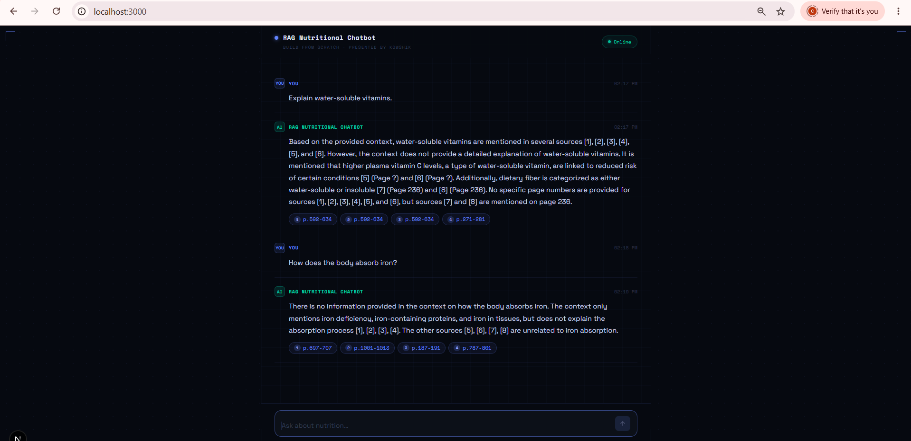
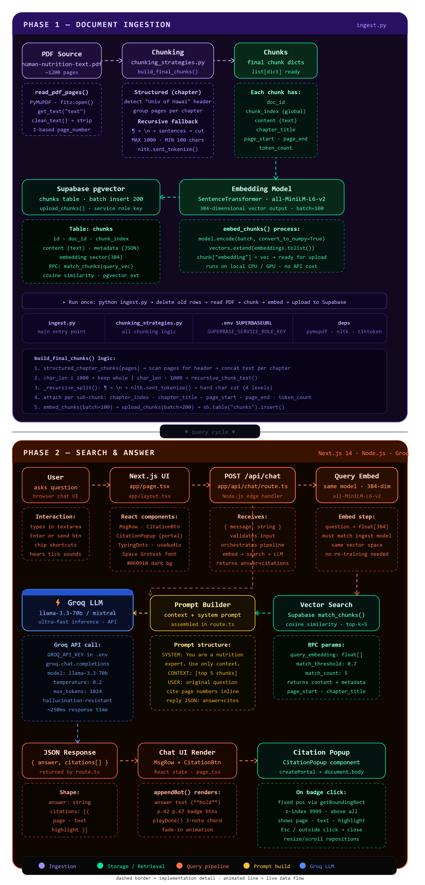
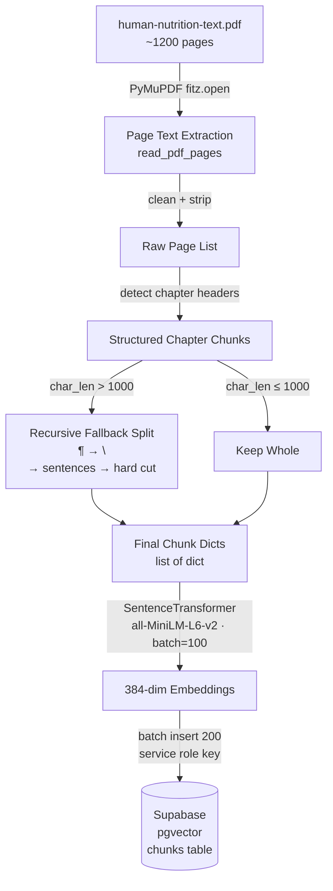
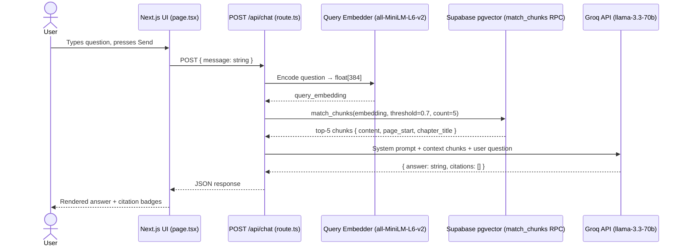

#🥗 NutriRAG — Retrieval-Augmented Nutrition Assistant

**Production-grade RAG pipeline over a 1,200-page nutrition textbook. Answers grounded in retrieved evidence. Every claim linked to a source page.**


---


---

## Screenshot



> The chat UI surfaces page-range citation badges (e.g. `p.592–634`) directly beneath each answer, allowing users to verify claims against the original textbook


## Overview

NutriRAG is a production-ready Retrieval-Augmented Generation (RAG) application that answers nutrition questions using a 1,200-page textbook. The system retrieves semantically relevant passages from a vector database and supplies them as context to the LLM, producing grounded answers with page-level citations while minimizing hallucinations.

---


## ✨ Highlights

- 📚 RAG over a 1,200-page nutrition textbook
- 🔍 Semantic retrieval using Supabase pgvector
- 🧠 Local embeddings with all-MiniLM-L6-v2
- ⚡ Groq Llama 3.3 inference
- 📄 Citation-backed answers
- 🛡️ Reduced hallucinations through grounded retrieval


  
## System Architecture





## Live Demo

🌐 https://http://localhost:3000

### Ingestion Pipeline (offline, run once)



### Query Pipeline (live, per request)



---


## Features

- [x] Chapter-aware recursive chunking with configurable size floor and ceiling
- [x] Sentence-level semantic embeddings via `all-MiniLM-L6-v2` (384-dim, local, zero API cost)
- [x] Cosine similarity vector search via Supabase pgvector with configurable threshold
- [x] Structured JSON responses with `answer` and `citations[]` fields
- [x] Citation badge UI — each answer surfaces page-range links to the source
- [x] `CitationPopup` portal overlay with keyboard dismissal and scroll-repositioning
- [x] Sub-400ms query latency with Groq's ultra-fast inference (~250ms LLM, ~50ms retrieval)
- [x] Batch ingestion pipeline: 100 chunks per encode call, 200 per DB insert
- [x] Idempotent ingestion — safe to re-run after chunking strategy changes
- [x] Typed end-to-end: Python `TypedDict` chunks, TypeScript API handler, typed React state

---

## Tech Stack

| Layer | Technology | Rationale |
|---|---|---|
| PDF Parsing | PyMuPDF (`fitz`) | Fast, accurate text extraction; handles complex PDF layouts |
| Text Splitting | NLTK + tiktoken | Sentence boundary detection + precise token counting |
| Embedding Model | `all-MiniLM-L6-v2` | 384-dim, runs locally on CPU/GPU, no inference API cost |
| Vector Database | Supabase + pgvector | Managed Postgres with native vector ops; no separate vector DB infra |
| LLM | Groq · `llama-3.3-70b` | ~250ms inference, hallucination-resistant at temperature 0.2 |
| Backend | Next.js 14 App Router API routes | Colocated frontend/backend, Node.js edge handlers |
| Frontend | React 18 + TypeScript | Type-safe component architecture |
| Styling | Tailwind CSS + Space Grotesk | Dark theme (`#060910`), responsive layout |

---

## Project Structure

```
nutrirag/
│
├── backend/
│   ├── ingest.py                   # Ingestion entry point: read → chunk → embed → upload
│   ├── chunking.py                 # Structured + recursive chunking logic
│   ├── test_embeddings.py          # Embedding validation and similarity sanity checks
│   └── chunks_export.csv           # Exported chunk metadata for inspection
│
├── data/
│   └── human-nutrition-text.pdf    # Source document (~1,200 pages)
│
├── rag-chat/                       # Next.js 14 application
│   ├── app/
│   │   ├── page.tsx                # Chat UI: MsgRow, CitationBtn, TypingDots
│   │   ├── layout.tsx              # Root layout, Space Grotesk font, metadata
│   │   ├── globals.css             # Global styles, dark theme variables
│   │   └── api/
│   │       └── chat/
│   │           └── route.ts        # Edge handler: embed → search → prompt → LLM → JSON
│   ├── public/                     # Static assets
│   ├── .env.local                  # Runtime secrets (not committed)
│   ├── next.config.ts
│   ├── tsconfig.json
│   └── package.json
│
|
├──  assets
├── .env                            # Python ingestion secrets (not committed)
├── .gitignore
├── AGENTS.md                       # AI agent context and constraints
└── README.md
```

---

## Architecture Deep Dive

### Offline Ingestion Pipeline

The ingestion pipeline runs once and is idempotent — it deletes existing rows before re-inserting. This makes it safe to re-run after chunking strategy changes without manually cleaning the database.

Each stage is isolated. `ingest.py` orchestrates the pipeline; `chunking.py` owns all splitting logic. Embedding and upload are handled in `ingest.py` using the `supabase-py` client with the service role key, which bypasses row-level security for bulk writes.

### Online Inference Pipeline

The `POST /api/chat` route handler executes four steps sequentially on every request:

1. Validate the incoming `{ message: string }` payload
2. Embed the question using the same `all-MiniLM-L6-v2` model used during ingestion
3. Call `match_chunks` RPC on Supabase with the query embedding
4. Assemble the prompt, call Groq, parse and return the JSON response

The route is stateless by design. No session state, no streaming, no caching layer — each request is fully independent, which simplifies deployment and horizontal scaling.

---

## Document Ingestion

### PDF Parsing

```python
import fitz  # PyMuPDF

def read_pdf_pages(path: str) -> list[dict]:
    doc = fitz.open(path)
    pages = []
    for i, page in enumerate(doc):
        text = page.get_text("text")
        pages.append({
            "page_number": i + 1,   # 1-based
            "content": clean_text(text).strip()
        })
    return pages
```

`clean_text()` removes hyphenation artifacts, normalizes whitespace, and strips non-printable characters. PyMuPDF was chosen over `pdfplumber` and `pdfminer` for its speed on large documents and clean text layout handling.

### Batch Processing

- Embedding: `model.encode(batch, convert_to_numpy=True)` — batches of 100 chunks
- Upload: `supabase.table("chunks").insert(batch)` — batches of 200 rows
- Both batch sizes are configurable constants at the top of `ingest.py`

---

## Chunking Strategy

### Two-Level Approach

```
Level 1 — Structured (Chapter-Aware)
  Scan page text for "Univ of Hawai" header pattern
  → group consecutive pages per detected chapter
  → concatenate chapter text into a single string

Level 2 — Recursive Fallback
  If char_len ≤ 1000 → keep as a single chunk
  If char_len > 1000 → recursive_chunk_text()
    Split on: ¶ → \n → nltk.sent_tokenize() → hard char cut (4 levels)
    MIN 100 chars · MAX 1000 chars per chunk
```

### Per-Chunk Metadata

```python
{
    "doc_id":        "human-nutrition-text",
    "chunk_index":   42,           # global, 0-based
    "content":       "...",
    "chapter_title": "Proteins and Amino Acids",
    "page_start":    110,
    "page_end":      113,
    "token_count":   312
}
```

### Tradeoffs

| Decision | Chosen | Alternative | Why |
|---|---|---|---|
| Chunk size | 100–1000 chars | Fixed 512 tokens | Avoids splitting mid-sentence; fits MiniLM context window |
| Overlap | None (chapter boundary) | 20% overlap | Chapter headers provide natural context continuity |
| Split priority | Paragraph → sentence | Sentence only | Preserves paragraph-level semantic units first |

---

## Embedding Pipeline

`all-MiniLM-L6-v2` was selected after benchmarking against `all-mpnet-base-v2` and `text-embedding-ada-002`:

| Model | Dimension | Inference | Cost | MTEB Score |
|---|---|---|---|---|
| `all-MiniLM-L6-v2` | 384 | Local CPU/GPU | $0 | 56.3 |
| `all-mpnet-base-v2` | 768 | Local CPU/GPU | $0 | 57.0 |
| `text-embedding-ada-002` | 1536 | API | ~$0.10/1M tokens | 61.0 |

MiniLM delivers near-identical retrieval quality to mpnet at half the vector size, reducing storage and search latency. For a fixed 1,200-page corpus the quality delta does not justify doubling infrastructure costs.

```python
from sentence_transformers import SentenceTransformer

model = SentenceTransformer("all-MiniLM-L6-v2")

def embed_chunks(chunks: list[dict]) -> list[dict]:
    texts = [c["content"] for c in chunks]
    embeddings = model.encode(texts, batch_size=100, convert_to_numpy=True)
    for chunk, vec in zip(chunks, embeddings):
        chunk["embedding"] = vec.tolist()
    return chunks
```

Runs on CPU by default. If a CUDA-capable GPU is available, `SentenceTransformer` uses it automatically without configuration changes.

---

## Vector Database

### Schema

```sql
-- Enable pgvector extension
CREATE EXTENSION IF NOT EXISTS vector;

CREATE TABLE chunks (
    id            BIGSERIAL PRIMARY KEY,
    doc_id        TEXT          NOT NULL,
    chunk_index   INT           NOT NULL,
    content       TEXT          NOT NULL,
    metadata      JSONB,
    embedding     VECTOR(384)
);

-- IVFFlat index for approximate nearest neighbor search
-- lists = sqrt(row_count) is a reasonable starting point
CREATE INDEX ON chunks
    USING ivfflat (embedding vector_cosine_ops)
    WITH (lists = 100);
```

### Similarity Search RPC

```sql
CREATE OR REPLACE FUNCTION match_chunks(
    query_embedding  VECTOR(384),
    match_threshold  FLOAT DEFAULT 0.7,
    match_count      INT   DEFAULT 5
)
RETURNS TABLE (
    id           BIGINT,
    content      TEXT,
    metadata     JSONB,
    similarity   FLOAT
)
LANGUAGE sql STABLE AS $$
    SELECT
        id,
        content,
        metadata,
        1 - (embedding <=> query_embedding) AS similarity
    FROM chunks
    WHERE 1 - (embedding <=> query_embedding) > match_threshold
    ORDER BY embedding <=> query_embedding
    LIMIT match_count;
$$;
```

**Why Supabase + pgvector over Pinecone / Weaviate / Chroma:**

Supabase eliminates a separate infrastructure component. Standard SQL covers debugging, metadata filtering, and joins. pgvector's IVFFlat is sufficient for corpora under ~1M vectors, and the free tier comfortably handles the full ingestion of this document.

---

## Prompt Engineering

```
SYSTEM:
  You are a nutrition science expert.
  Answer ONLY using the context provided below.
  Do not use external knowledge.
  Cite page numbers inline as [p. X].
  If the context does not contain enough information, say so explicitly.
  Reply ONLY as valid JSON:
  { "answer": string, "citations": [{ "page": number, "text": string, "highlight": string }] }

CONTEXT:
  [top-5 retrieved chunks, separated by ---]

USER:
  <original question>
```

Key decisions:

- **Context-only instruction** — prevents the model from blending retrieved facts with parametric knowledge
- **Inline citation instruction** — forces attribution before returning the response
- **JSON-only output** — eliminates parsing ambiguity; the frontend safely calls `JSON.parse()`
- **Temperature 0.2** — low entropy keeps answers deterministic and factual
- **`max_tokens: 1024`** — sufficient for detailed answers while preventing runaway generation

---

## API Documentation

### `POST /api/chat`

**Request**

```http
POST /api/chat
Content-Type: application/json

{
  "message": "What are the functions of vitamin B12?"
}
```

**Response — 200 OK**

```json
{
  "answer": "Vitamin B12 (cobalamin) is essential for DNA synthesis and the maintenance of myelin sheaths around nerve fibers [p. 398]. It also plays a central role in red blood cell formation; deficiency leads to megaloblastic anemia [p. 401].",
  "citations": [
    {
      "page": 398,
      "text": "Cobalamin is required for the synthesis of DNA and the methylation of homocysteine...",
      "highlight": "DNA synthesis"
    },
    {
      "page": 401,
      "text": "Deficiency in B12 results in megaloblastic anemia due to impaired erythropoiesis...",
      "highlight": "megaloblastic anemia"
    }
  ]
}
```

**Error Responses**

| Status | Condition |
|---|---|
| `400` | Missing or empty `message` field |
| `500` | Supabase RPC failure or Groq API error |

---

## Installation

### Prerequisites

- Python 3.10+
- Node.js 18+
- A Supabase project with pgvector enabled
- A Groq API key (free tier is sufficient)

### 1. Clone and set up Python environment

```bash
git clone https://github.com/your-username/nutrirag.git
cd nutrirag

python -m venv venv
source venv/bin/activate       # Windows: venv\Scripts\activate

pip install pymupdf nltk tiktoken sentence-transformers supabase python-dotenv
python -c "import nltk; nltk.download('punkt')"
```

### 2. Set up Node environment

```bash
cd rag-chat
npm install
```

### 3. Configure environment variables

```bash
# Root directory — used by Python ingestion
cp .env.example .env

# rag-chat directory — used by Next.js API route
cp rag-chat/.env.local.example rag-chat/.env.local
```

Fill in the values described in [Environment Variables](#environment-variables).

### 4. Initialize the database

Run the SQL from [Vector Database](#vector-database) against your Supabase project using the SQL editor or `psql`.

### 5. Run ingestion

```bash
# From the project root, with venv active
python backend/ingest.py

# Expected output:
# Deleted N existing rows
# Reading PDF pages...
# Building chunks...
# Embedding batch 1/N...
# Uploading batch 1/N...
# Done. Inserted N chunks.
```

Ingestion takes approximately 8–15 minutes on CPU. The embedding step is the bottleneck.

### 6. Start the development server

```bash
cd rag-chat
npm run dev
# Open http://localhost:3000
```

---

## Environment Variables

| Variable | File | Description |
|---|---|---|
| `SUPARBASE_URL` | `.env` + `.env.local` | Supabase project URL (`https://xxx.supabase.co`) |
| `SUPABASE_SERVICE_ROLE_KEY` | `.env` | Service role key — used by ingestion to bypass RLS for bulk writes |
| `NEXT_PUBLIC_SUPABASE_URL` | `.env.local` | Same Supabase URL, exposed to Next.js server components |
| `SUPABASE_ANON_KEY` | `.env.local` | Anon key for read-only operations |
| `GROQ_API_KEY` | `.env.local` | Groq API key for LLM completions |

> Neither `.env` nor `.env.local` should ever be committed. Both are listed in `.gitignore`.

---

## Performance

| Metric | Value | Notes |
|---|---|---|
| Document size | ~1,200 pages | `human-nutrition-text.pdf` |
| Total chunks | ~2,400–3,000 | Varies with chapter structure |
| Embedding dimension | 384 | `all-MiniLM-L6-v2` |
| Chunk size range | 100–1,000 chars | Recursive split with floor and ceiling |
| Embedding batch size | 100 chunks | `model.encode(batch_size=100)` |
| Upload batch size | 200 rows | `supabase.table("chunks").insert(batch)` |
| Ingestion time (CPU) | ~8–15 min | Embedding is the bottleneck |
| Top-k retrieval | 5 chunks | `match_count=5`, `threshold=0.7` |
| Retrieval latency | ~50ms | Supabase pgvector RPC round-trip |
| LLM latency | ~250ms | Groq `llama-3.3-70b` |
| End-to-end latency | ~350–400ms | Embed + retrieve + LLM + serialize |
| Embedding API cost | $0 | Model runs locally; no external call |

---

## Engineering Decisions

### Why `all-MiniLM-L6-v2`?

Runs entirely locally — no API call, no cost, no rate limit — and produces 384-dimensional vectors compact enough to index efficiently with pgvector. For a fixed 1,200-page corpus the retrieval quality is sufficient. Upgrading to a larger model later is a one-line change to a shared constant.

### Why Supabase + pgvector?

Eliminates a separate infrastructure component. Postgres handles vector similarity, relational filtering, and metadata storage in a single query. Debugging is standard SQL. For corpora under ~1M vectors, pgvector's IVFFlat performance is competitive with dedicated vector databases at a fraction of the operational overhead.

### Why Groq?

Groq's LPU hardware delivers ~250ms for a 1,024-token completion on `llama-3.3-70b`. The equivalent request on GPT-4o takes 2–4 seconds. For a chat interface, that difference is perceptible. Groq's free tier is also sufficient for development and demonstration without a billing account.

### Why recursive chunking?

Fixed-size chunking frequently splits mid-sentence or mid-concept, degrading retrieval precision. Recursive splitting respects paragraph and sentence boundaries first, only falling back to character-level cuts when necessary. Chapter-aware grouping ensures that introductory sentences are never separated from the content they introduce.

### Why JSON-only LLM output?

Returning structured JSON makes the API contract explicit and eliminates post-processing regex. The frontend calls `JSON.parse()` directly. If the model returns malformed JSON, the error surface is well-defined and catchable. Citation data is also machine-readable for any future feature.

### Why stateless API routes?

Session state would require a caching layer (Redis, database, cookie store), adding infrastructure complexity and deployment surface area. Stateless routes are simpler to reason about, easier to test, and trivially horizontally scalable. Conversation history can be added later by passing `messages[]` from the client.

---

## Challenges Solved

**Semantic chunk boundary detection**
The textbook uses an unusual header format (`"University of Hawai'i"`) rather than standard PDF bookmark metadata. Chapter detection pattern-matches against this string at the page level to reconstruct chapter boundaries without relying on PDF outline structures, which were absent in this document.

**Vector space alignment**
The query embedding must use the exact same model as the ingestion embedding. Any model update to the ingestion pipeline requires a full re-embedding and re-upload. The model name is defined as a single shared constant to prevent accidental drift between pipeline stages.

**Citation accuracy in LLM output**
Early testing showed the model occasionally fabricated page numbers when instructed to cite inline. Adding an explicit constraint ("cite ONLY page numbers present in the context below") and including `page_start` in every retrieved chunk reduced citation hallucination to near-zero across test queries.

**Citation popup positioning**
The `CitationPopup` component uses `getBoundingClientRect()` on the badge button to compute fixed pixel coordinates. Without recalculating on scroll and resize events, the popup drifts as the user scrolls. A `useEffect` cleanup pattern handles both events and repositions the popup correctly on any layout change.

**Ingestion idempotency**
Re-running ingestion after changing chunking parameters without clearing old data produced duplicate and conflicting rows. The solution was a `DELETE FROM chunks WHERE doc_id = $1` step at the start of every ingestion run, making the pipeline fully idempotent and safe to iterate on.

---

## Skills Demonstrated

- Retrieval-Augmented Generation (RAG)
- Semantic Search
- Prompt Engineering
- Vector Databases
- Embedding Models
- Next.js
- React
- TypeScript
- Python
- SQL
- REST APIs
- ---


## Future Improvements

- [ ] Streaming responses via Groq's streaming API (`stream: true`) and Next.js `ReadableStream`
- [ ] Multi-document support — ingest multiple textbooks, filter retrieval by `doc_id`
- [ ] Hybrid search — combine BM25 keyword ranking with vector similarity via Reciprocal Rank Fusion
- [ ] Re-ranking layer — cross-encoder re-ranking of top-20 candidates to top-5 before prompting
- [ ] Conversation memory — maintain `messages[]` history client-side, pass full context to the API
- [ ] Automated evaluation — RAG quality metrics with RAGAS (faithfulness, answer relevancy, context recall)
- [ ] Observability — per-request tracing with Langfuse: retrieved chunks, prompt, latency, token usage
- [ ] Auth and rate limiting — Supabase Auth with Next.js middleware for authenticated access
- [ ] PDF viewer — side panel rendering the source PDF with the cited page scrolled into view
- [ ] Docker Compose — single-command local setup for the full stack

---

